培训手册链接：https://chiseled-chili-ce0.notion.site/0afe1a66699f4c51ad53649e63bd61bb  
如何使用markdown链接：https://blog.csdn.net/qq_40818172/article/details/126260661
# 一、第一阶段任务总览
1. 开发工具学习：Pycharm / VSCode使用篇，两个开发工具二选一(推荐vscode)
2. docker/Conda基础入门篇,要求可以实现自己开发环境搭建，分别在docker和conda下完成python环境搭建（以python可以输出hello word为标准）
3. Linux 基础入门篇熟悉Linux基础命令（对常见命令进行操作，要求截图下来命令执行结果，这里Linux系统大家可以使用本地虚拟机）
## 1.vscode使用
## 2.anaconda使用
### 什么是anaconda？
anaconda——环境管理工具；base理解为一个大厅，建立一些环境，比如说我简历bai_3_8，里面就包含我安装的torch、torchvision、numpy等安装包。
## 3.linux基础命令
### Chapter1: linux简介
很多公司会基于linux内核来开发属于自己的操作系统，linux包含了内核、系统库、shell、应用程序等等
+ **内核** ：是linux系统的核心、基础，负责管理系统的硬件和提供最基本的系统服务，包含设备驱动管理、进程管理、内存管理、文件系统、网络协议栈等等关键的底层功能和组件
+ **系统库**：用于支持应用程序开发的软件库，提供了一些常用的函数和接口，方便基于这些接口来开发应用程序，eg:C标准库、数学库、动态链接库、线程库、第三方库
+ **shell**：命令行解释器，类似于套在内核外面的一个壳，使用户使用linux系统的接口，接受用户输入的各种命令，然后把他们传递给操操作系统来执行
+ **应用程序**：平时使用的各种应用软件  

linux发行版：包括内核、应用软件、系统工具、库文件、图形界面、shell、包管理器组成的一个完整的操作系统，提供了一个预先配置好的linux环境，使我们能够方便的安装、配置和使用linux系统，每个发行版都有自己的包管理器、桌面环境和一些特定的工具，选择发行版一般取决于用户的需求或者偏好，eg:ubuntu适用于个人桌面用户，kali适用于网络安全和渗透测试；alpine由于体积小，适用于容器化的应用等等  

---
> 如何安装配置linux系统？
>>虚拟机软件、容器安装、云服务器
虚拟机软件的有点是不会影响到我们正常使用的系统，而且可以随时的打开和关闭，市面上的虚拟机工具有很多种，如果使用的是windows系统的话，推荐使用**vmware**和**virtualbos**，都比较成熟、比较流行，直接使用虚拟机，安装一个linux系统就好；如果是mac电脑的话，可以使用Mutipass，优点是轻量、快速、支持命令行，缺点是只支持乌班图系统，最大的优点是使用命令来创建和管理虚拟机
云服务器可以随时随地访问，缺点是需要支付一定的费用

>>安装过程：先安装vmware虚拟机；vm官网：https://www.vmware.com/products/desktop-hypervisor/workstation-and-fusion
安装版本是windows17.6，安装完成之后现有win+r,然后输入ncpa.cpl，检查是否出现v1和v8，如果出现，表示虚拟机是可以上网的

>>在vmware种安装centos7linux操作系统——选用centos7.6的版本——下载网址https://vault.centos.org/7.6.1810/isos/x86_64/——然后找到centos-7-x86-DVD-1810.iso(4.3G)  
  
  >>远程链接linux系统——打开终端，输入ifconfig，就可以找到linux的ip地址，然后打开finalshell,点击白色的加号，主机那里写ip地址  
  用ls命令看两者的结果是否一致

### Chapter2: 一些基础的命令结构（要求截图命令执行结果）
#### linux的目录结构  
linux的顶级目录是一个/，叫做根目录。描述路径的时候永远都以斜杠作为开头，开头的斜杠表示根目录，后面的斜杠表示层级关系（把根目录理解成还没有分盘的电脑？）  

---
#### linux命令
##### 1.linux命令的基础

###### （1）什么是命令？
命令vs命令行
学习linux本质上就是学习在命令行下熟练使用linux的各种命令。  
命令行也可以称为linux终端（Terminal），字符化命令  
命令：linux的可执行程序
输入命令，得到字符化的反馈

###### （2）linux命令的基础格式
**command [-options] [parameter]**
+ command:命令本身
+ -options：非必填，命令的一些*选项*，可以通过选项控制命令的*行为细节*
+ parameter：非必填，命令的参数，多数用于命令的指向目标等
+ eg1:**ls -l/home/itheima**,ls是命令本身，-l是选项，/home/itheima是参数——**意思是以列表的形式，显示/home/itheima目录内的内容**
+ eg2:**cp -r test1 test2**,cp是命令本身，-r是选项，test1和test2是参数——**意思是复制文件夹test1成为test2**  

---

##### 2.ls命令  
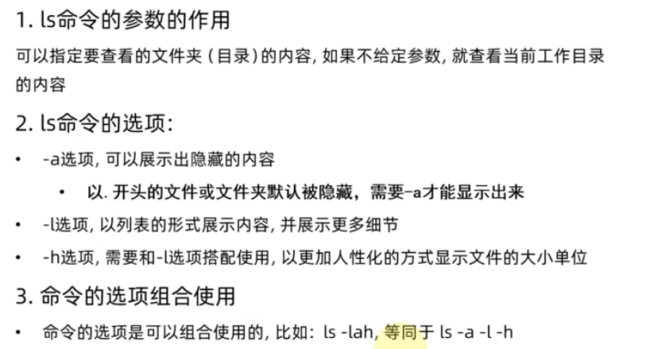
对照图形化页面，快速体验第一个命令ls  
ls命令就是列出目录下的工作内容  
语法细节 ：  
**ls [-a -l -h] [linux路径]**
+ -a -l -h 是可选的选项
+ linux路径是此命令可选的参数   
+ 当没有后面两个东西的时候，变送以平铺的方式列出当前工作目录下的内容  
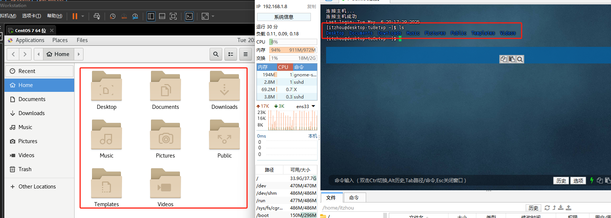
---
理解什么是HOME目录、当前工作目录  
在finalshell中通过ls命令就可以打开当前的工作目录，当前的工作目录就是home目录，也成为家目录，最开始的时候默认home目录就是家目录。  
home目录是每一个用户专属的目录，默认在：/home/用户名  

---
ls命令的参数使用和选项使用：  
place——>computer:打开根目录的内容；ls /  
>-a (all) :表示列出全部的文件，包含隐藏文件  
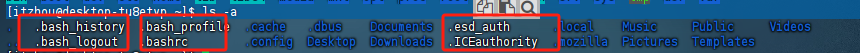  
前面.开头的都是隐藏的文件，我图上只圈了白色的字，其实.开头的蓝字也是  
>-l（list):表示以列表的形式，就是竖着的列出所有的文件  
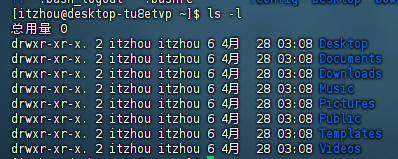  
横向的平铺变成属相的列表，并且给出的信息还变多了  
>>-a 和 -l 组合使用  
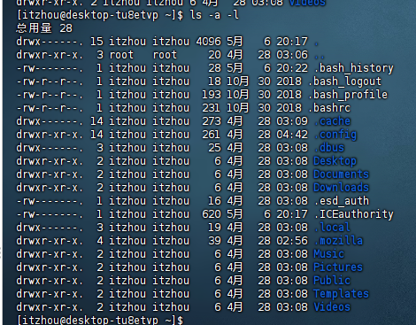  
>>选项和参数也可以组合使用  
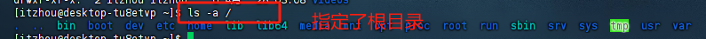    

>-h:可以列出文件的大小，采用易于阅读的模式（lh必须混合使用）   
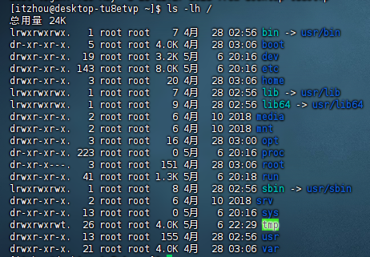

##### 3. 目录切换的相关命令cd/pwd命令  
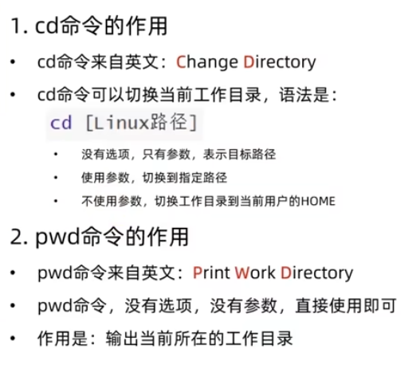  
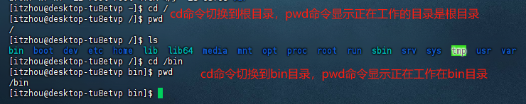  

##### 4.相对路径、绝对路径和特殊路径符  
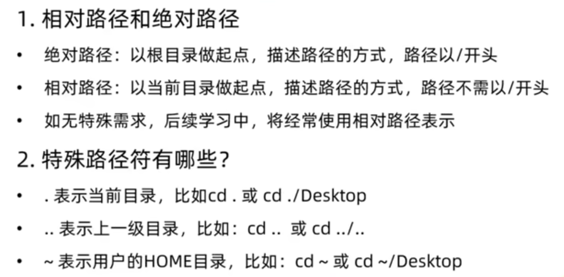  

##### 5.创建目录命令mkdir
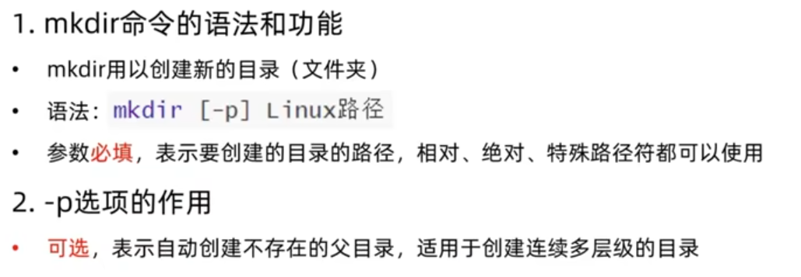  

##### 6.文件操作命令（touch、cat、more、cp、mv） 
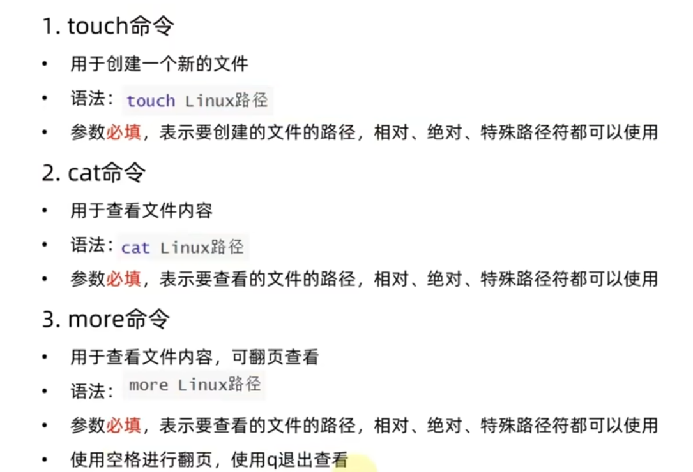  
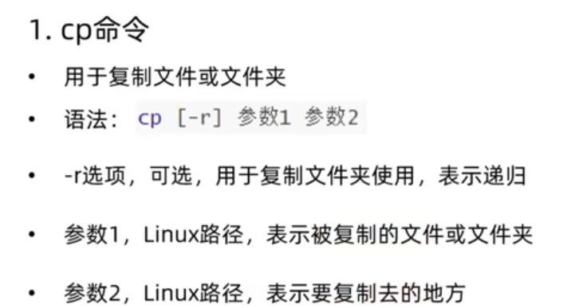    
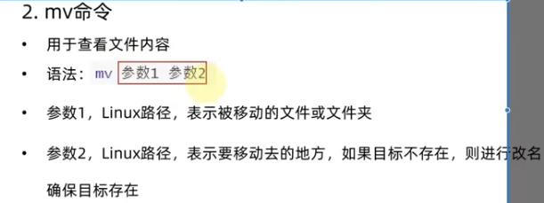
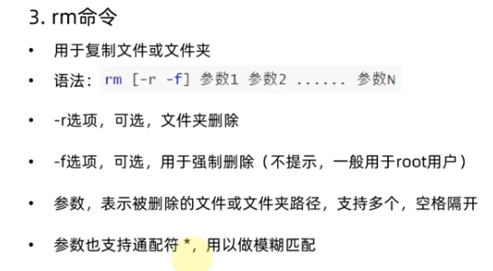  

##### 7.查找命令（which、find）
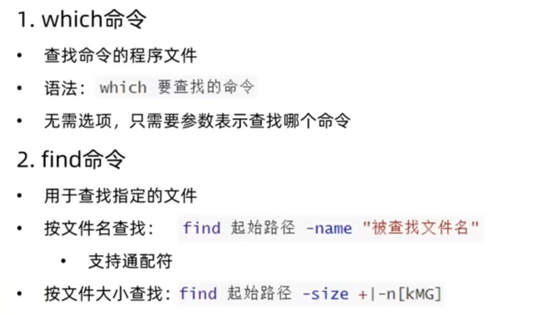  

##### 8.grep-wc管道符
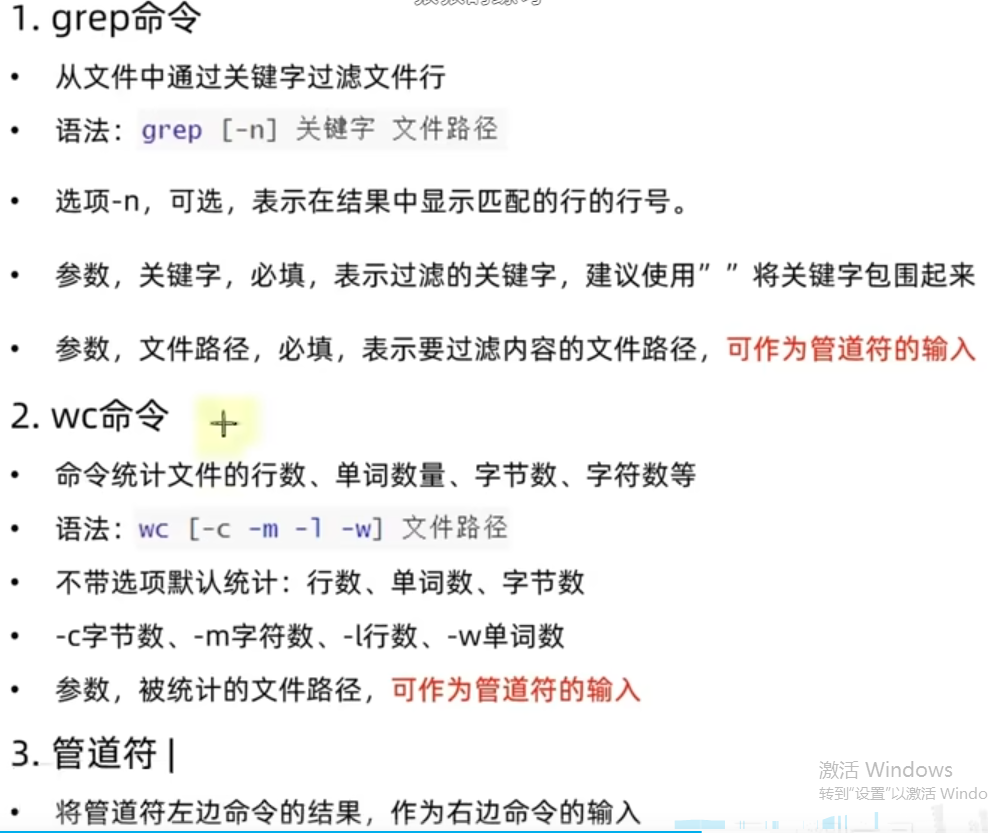  

##### 9.echo-tail-重定向符  
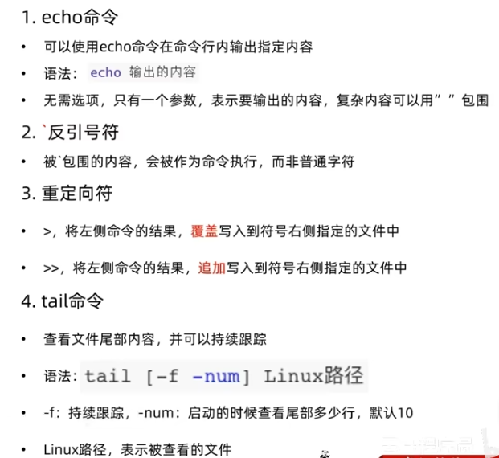  

## 4.git使用方法  

# 二、动手学深度学习笔记  
近期任务《动手学深度学习》  https://zh-v2.d2l.ai/index.html  ———— 1. 1-6章节（两周）2. 7-13章节 （两周）